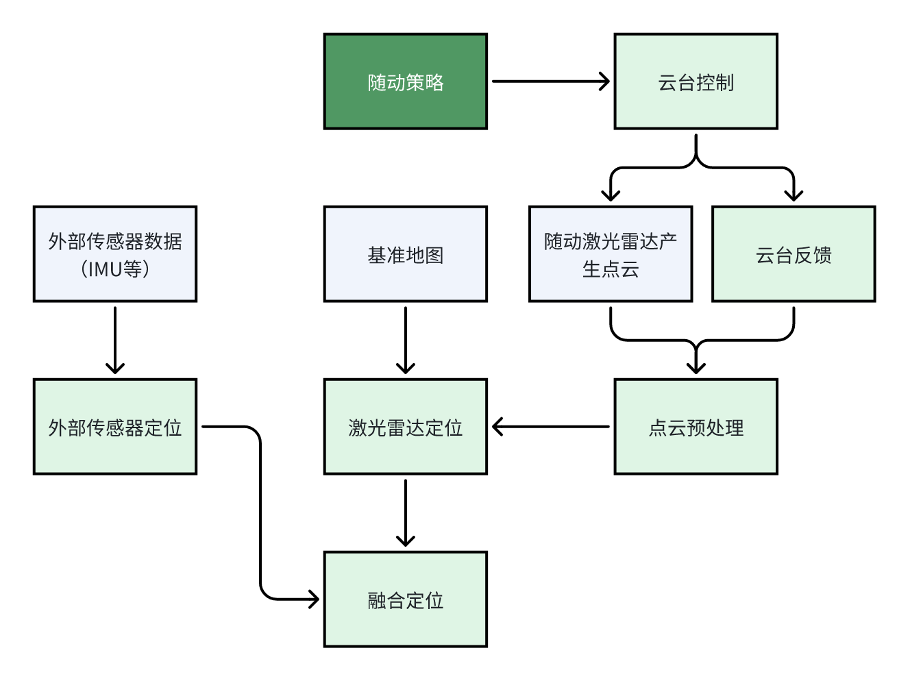
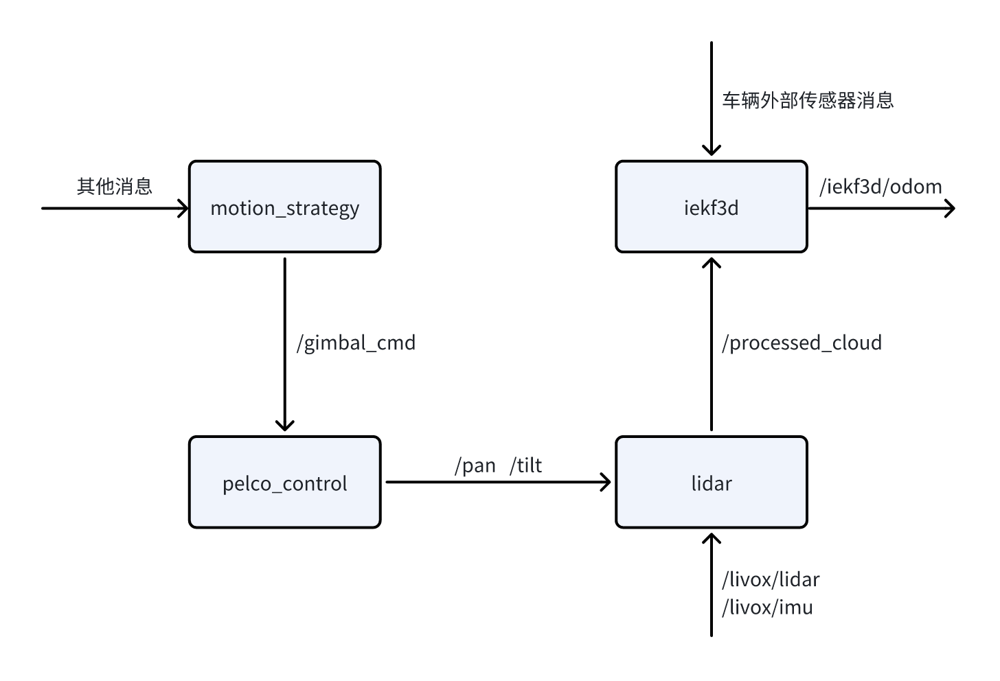
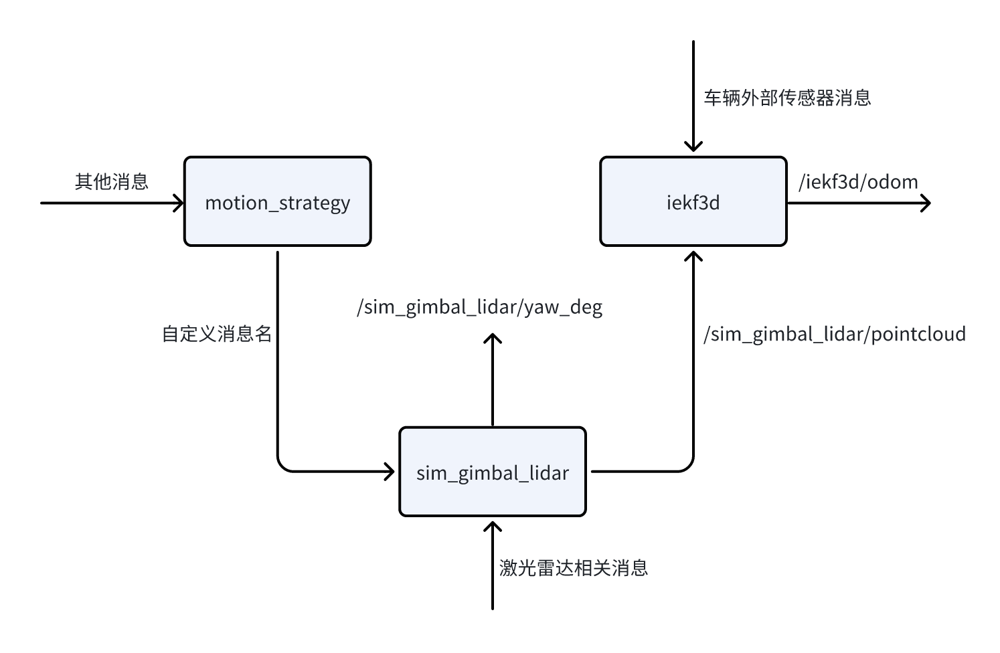

# 随动激光雷达算法模块

## 总体框架

硬件系统相关见 [随动云台-激光雷达系统](https://sjtu.feishu.cn/wiki/QZKJwFRObiEUmnkkAoCcdzzKnbh)。

总体框架如下：



代码中 `iekf3d` 为**定位模块**，包含外部传感器定位、激光雷达定位和两者的融合定位；`lidar` 为**点云预处理模块**；`pelco_control` 为**云台控制和反馈模块**。

## 模块信息

### 定位（iekf3d）

采用基于 IEKF 的紧耦合方法，通过点到面 ICP 计算点云匹配误差，融合激光雷达定位和 IMU、GNSS、轮速计等外部传感器的定位。

### 点云预处理（lidar）

主要用于点云去旋转畸变，同时把点云转换到云台坐标系下。

### 云台（pelco_control）

云台为两轴（yaw、pitch），两轴均可用。可通过指令控制云台，同时会实时反馈云台的 yaw 和 pitch 角。

### 虚拟随动（sim_gimbal_lidar）

接收 360° 激光雷达和虚拟云台指令，输出水平 FoV 为 70.4° 的模拟非重复扫描点云，同时会反馈虚拟云台的 yaw 角。

## 各模块间 ROS 消息的名称和流向

实车项目中的关键 ROS 消息流程如下：



虚拟随动的关键 ROS 消息流程如下：



## 开发方法

### 云台指令

云台的两轴均可控制，`pelco_control` 模块会根据 `/gimbal_cmd` 指令进行对应控制。

`/gimbal_cmd` 消息为 `cyber_msgs::GimbalCommand` 类型，需要包含头文件 `GimbalCommand.h`。

`cyber_msgs::GimbalCommand` 类型定义在[cyber_msgs::GimbalCommand定义](common/cyber_msgs/msg/GimbalCommand.msg)。`cmd`表示 pelco-d 协议对应的指令。

可以先定义枚举变量：

```cpp
typedef enum command
{
  STOP = 0x00,        // 停止
  UP = 0x08,          // 上
  DOWN = 0x10,        // 下
  LEFT = 0x04,        // 左
  RIGHT = 0x02,       // 右
  UPLEFT = 0x0C,      // 上左, 12
  UPRIGHT = 0x0A,     // 上右, 10
  DOWNLEFT = 0x14,    // 下左, 20
  DOWNRIGHT = 0x12,   // 下右, 18
  PAN = 0x4B,         // 水平旋转至指定角度, 75
  TILT = 0x4D,        // 俯仰旋转至指定角度, 77
  ASKPAN = 0x51,      // 查询水平位置, 81
  ASKTILT = 0x53      // 查询俯仰位置, 83
};
```

若`cmd`为角度控制（PAN、TILT），`data`是角度制单位的整数；若`cmd`为角速度控制（RIGHT等），`data`是0-63范围内的整数。

云台反馈消息 `/pan` `/tilt` 为 `std_msgs::Float64MultiArray` 类型，`data[0]` 是时间戳， `data[1]` 是对应角度制的角度。

### 虚拟随动

只能控制yaw角，可以按角度控制或按角速度控制。控制消息为 `std_msgs::Float64MultiArray` 类型， `data[0]` 是时间戳， `data[1]` 是指令数据（角度制）。

控制指令消息的名称在 `config` 文件中配置。

```yaml
lidar_topic: ...  # 360°激光点云
yaw_deg_topic: ...
yaw_deg_angular_velocity_topic: ...
```

反馈消息 `/sim_gimbal_lidar/yaw_deg` 为 `std_msgs::Float64MultiArray` 类型，`data[0]` 是时间戳， `data[1]` 是对应角度制的角度。

### 融合定位

`iekf3d` 的 `config` 文件进行定位相关配置。主要需要修改激光雷达topic和外参。

```yaml
#预处理后的点云
pointcloud2_topic: ...

# 外参，lidar -> body(gps)， [tx, ty, tz, euler_x, euler_y, euler_z]
lidar_extinct: [1.15, 0, 1.96, 0, 0, 1.5315] #hesai，其他激光雷达需要标定
```

`iekf3d` 包括了点云预处理，但是对于非重复扫描雷达目前无法进行畸变校正。

定位结果有两个消息。 `/iekf3d/odometry` 是 ROS 内置的 `nav_msgs::Odometry` 类型。`/localization/estimation` 是自建 `cyber_msgs::LocalizationEstimate` 类型，需要包含头文件`cyber_msgs/LocalizationEstimate.h`，消息定义在[cyber_msgs::LocalizationEstimated定义](common/cyber_msgs/msg/LocalizationEstimate.msg)中，目前加速度和角加速度没有意义。

发布点云消息的含义可以在rviz中查看。

### 运行

**docker相关内容是老项目的**

- load docker image
  
  docker load -i lidar_gimbal_loc.tar

- run docker container
  
  see run_docker.sh

- build
  
  catkin_make -DCMAKE_EXPORT_COMPILE_COMMANDS=ON

- mapping
  
  see mapping.sh

- localization
  
  see localization.sh

  rviz -d iekf3d/configs/lidar3d.rviz

- lidar node
  
  rosrun lidar lidar_node

- gimbal control node
  
  rosrun pelco_control pelco_control_node

- sim-gimbal-lidar node

  rosrun sim_gimbal_lidar sim_fimbal_lidar_node

# Voxel Motion Strategy

基于体素地图的 LiDAR 云台运动策略。通过等距矩形投影（ERP）将周围体素映射为深度图，搜索最优云台朝向以最大化 LiDAR 扫描区域的几何丰富度（ICP 可定位性）。

## 构建

```bash
cd ~/loc_ws
catkin_make --pkg voxel_motion_strategy
```

## 使用

### 1. 构建体素地图

首先从全局点云地图构建 Octomap 并序列化，只需执行一次：

```bash
# 构建 octomap（使用 iekf3d 的全局地图）
./devel/lib/voxel_motion_strategy/octomap_builder_test \
  /home/loc/loc_ws/data/SJTU_251114_allMap/global_01subsample_all_new.ply \
  /home/loc/loc_ws/data/SJTU_251114_allMap/map-normal.ply \
  /home/loc/loc_ws/data/octomap_out \
  --voxel 1.0 --range 150
```

产出两个文件：
- `octomap_out.ot` — 序列化的 OcTree
- `octomap_out.normals` — 每个体素的平均法向量

`--range` 控制从地图原点（UTM 原点）算起的最大距离（米）。可以根据运行区域调整，或用 `--range -1` 包含全图。

### 2. 配置

编辑 `configs/voxel_strategy.yaml`，关键参数：

```yaml
octomap_prefix: "/home/loc/loc_ws/data/octomap_out"  # 步骤1产出的前缀

# LiDAR 外参，与 iekf3d/configs/configs.yaml 格式一致，直接复制
lidar_extinct: [1.08, 0.0, 1.643, 1.67, 0.49, 89.24]
```

### 3. 启动策略节点

```bash
roslaunch voxel_motion_strategy voxel_strategy.launch
```

节点订阅：
- `/iekf3d/odometry` (`nav_msgs/Odometry`) — 车辆定位位姿
- `/pan` (`std_msgs/Float64MultiArray`) — 云台当前 pan 角度反馈

节点发布：
- `/gimbal_cmd` (`cyber_msgs/GimbalCommand`) — 云台 PAN/TILT 命令

### 4. 可视化与调试工具

```bash
# 在指定位姿生成 ERP 深度图（PPM 格式）
./devel/lib/voxel_motion_strategy/erp_viz <octomap_prefix> <x> <y> <z> [output.ppm]

# 生成 score-vs-yaw 分析 + 最佳朝向深度图
./devel/lib/voxel_motion_strategy/rect_viz <octomap_prefix> <x> <y> <z> [csv_out] [ppm_out]

# 体素法向量一致性分析
./devel/lib/voxel_motion_strategy/octomap_test <points.ply> [normals.ply] --voxel-size 1.0
```

## 架构

```
全局地图 (.ply)  →  Octomap (.ot + .normals)
                              │
车辆位姿 ─────────────────────┤
云台反馈 ─────────────────────┤
                              ▼
                    ERP 投影 (erp_projector)
                              │
                   积分图构建 (integral_image)
                              │
                 yaw 约束 + 矩形搜索 (rectangle_search)
                              │
                         /gimbal_cmd
```

详见 [DESIGN.md](DESIGN.md)。

